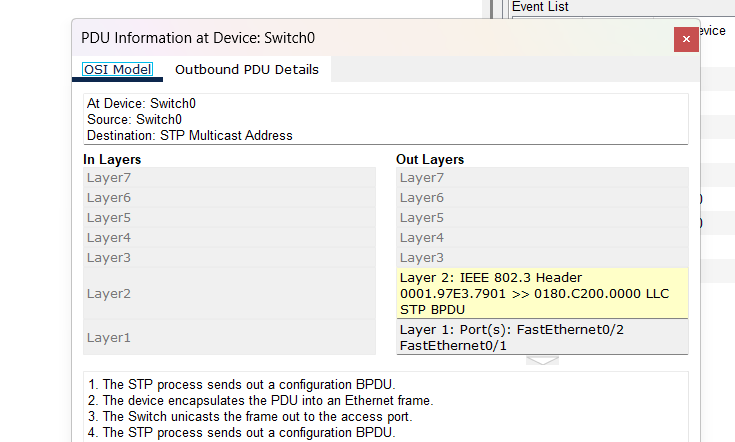
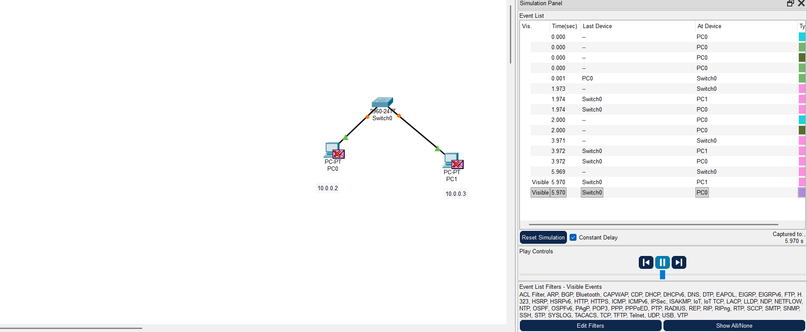

# Lab 01: L2 Switch Configuration

## 🎯 Objective
- Connect two PCs via a switch
- Assign IP addresses
- Verify OSI model communication using simulation in Cisco Packet Tracer

## 🛠 Topology

## ⚙️ Steps
1. Drag two PCs and a switch in Packet Tracer.
2. Connect them with Copper Straight-Through cables.
3. Assign IP addresses:
   - PC1: 10.0.0.2
   - PC2: 10.0.0.3
4. Verify OSI model using simulation then packet is transferred
