# 🌐 Networking Concepts – Day’s Learning (Cisco Devices & Subnetting)

## 1️⃣ Subnetting

### 🔹 Introduction
Subnetting is the process of dividing a large network into smaller, more manageable sub-networks (subnets). It improves network performance, security, and management efficiency.

### 🔹 Purpose
- Efficient IP address utilization  
- Enhanced network performance  
- Simplified troubleshooting  
- Improved security and isolation  

### 🔹 Key Terms
- **Network ID:** Identifies the network portion of an IP address.  
- **Host ID:** Identifies individual devices within a subnet.  
- **Subnet Mask:** Defines how many bits are used for the network and host portions.

### 🔹 Example
For a Class C network `192.168.10.0/24`:  
If we subnet with `/26`, we get:
- Subnet 1: `192.168.10.0 – 192.168.10.63`
- Subnet 2: `192.168.10.64 – 192.168.10.127`
- Subnet 3: `192.168.10.128 – 192.168.10.191`
- Subnet 4: `192.168.10.192 – 192.168.10.255`

Each subnet supports **62 hosts** (64 - 2).

---

## 2️⃣ Cisco Router

### 🔹 Introduction
A **Cisco Router** is a networking device that connects multiple networks and directs data packets between them based on IP addressing.

### 🔹 Types of Cisco Routers
- **Branch Routers:** For small to medium businesses (e.g., Cisco 4000 Series ISR).  
- **Edge Routers:** Connects internal networks to the internet (e.g., ASR Series).  
- **Core Routers:** High-performance routers used in data centers.  
- **Virtual Routers:** Software-based routers (e.g., CSR 1000v).

### 🔹 Features
- Routing protocols support (OSPF, EIGRP, BGP)  
- Network security (ACLs, VPNs)  
- QoS (Quality of Service)  
- Redundancy and high availability  

### 🔹 Benefits
- Efficient data routing  
- Network scalability  
- Enhanced security and control  
- Support for WAN and VPN connectivity  

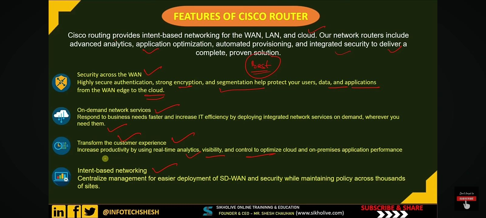
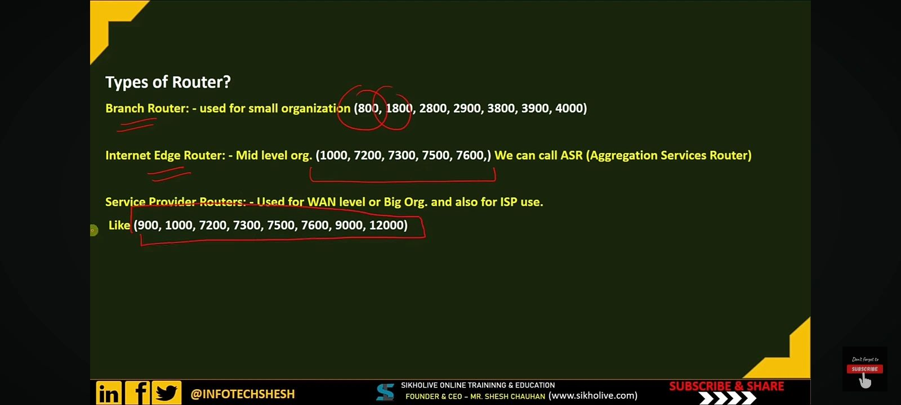
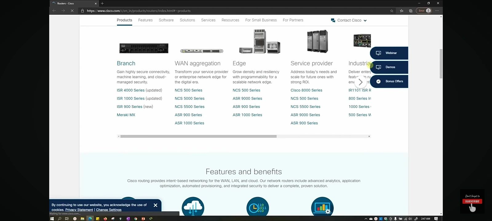
---

## 3️⃣ Cisco Switch

### 🔹 Introduction
A **Cisco Switch** is a Layer 2 or Layer 3 network device that connects devices within a local area network (LAN) and forwards data based on MAC or IP addresses.

### 🔹 Types of Cisco Switches
- **Unmanaged Switches:** Simple, plug-and-play devices.  
- **Managed Switches:** Configurable via CLI or web interface.  
- **Layer 3 Switches:** Perform routing functions in addition to switching.  
- **PoE (Power over Ethernet) Switches:** Provide power to devices like IP cameras and phones.

### 🔹 Features
- VLAN support  
- Spanning Tree Protocol (STP)  
- Port security  
- Link aggregation  
- QoS and network monitoring  

### 🔹 Benefits
- Improved network efficiency  
- Easier network management  
- Enhanced security and traffic segmentation  
- Reliable and scalable performance  

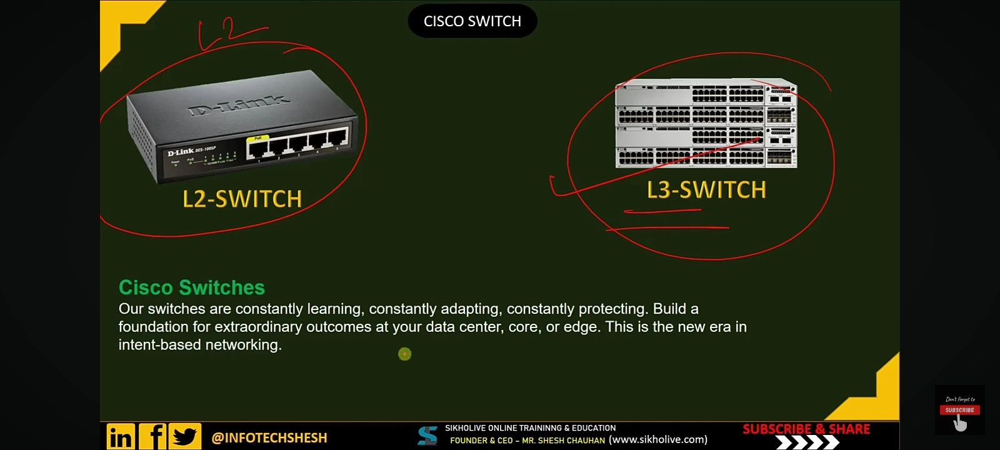
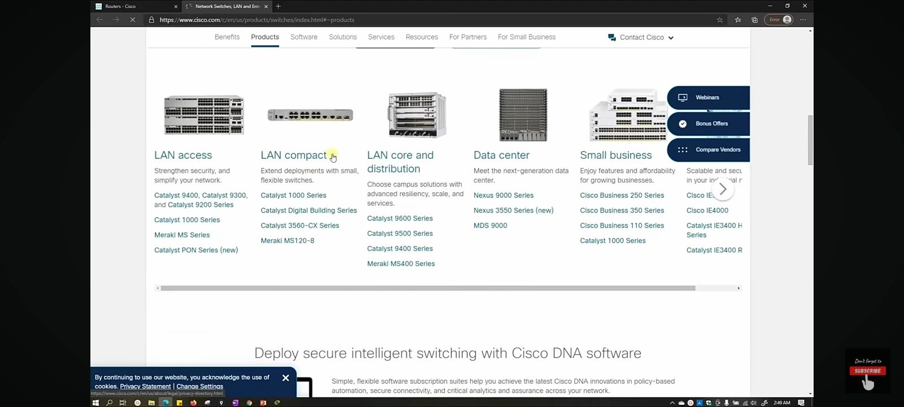
---

## 4️⃣ Cisco Firewall

### 🔹 Introduction
A **Cisco Firewall** is a security device that monitors and controls incoming and outgoing network traffic based on predetermined security rules.

### 🔹 Types of Cisco Firewalls
- **Cisco ASA (Adaptive Security Appliance):** Traditional hardware firewall.  
- **Cisco Firepower Next-Generation Firewall (NGFW):** Includes intrusion prevention, malware protection, and URL filtering.  
- **Cisco Meraki MX:** Cloud-managed security appliance.

### 🔹 Features
- Stateful packet inspection  
- VPN support  
- Intrusion prevention system (IPS)  
- Application visibility and control  
- URL filtering and malware protection  

### 🔹 Benefits
- Strong protection from external threats  
- Centralized management and visibility  
- Policy-based access control  
- Enhanced threat intelligence with Cisco Talos  

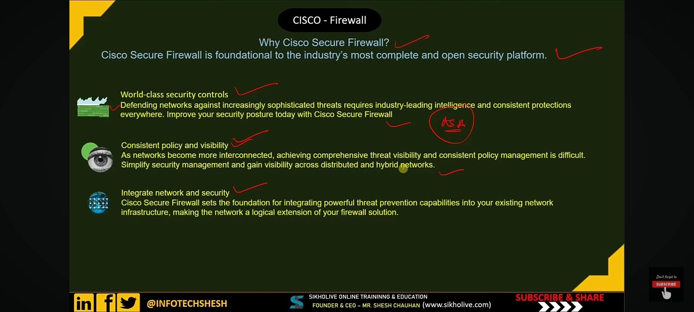
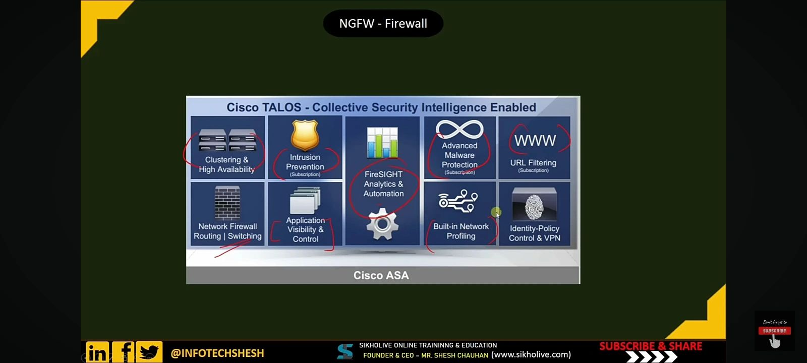
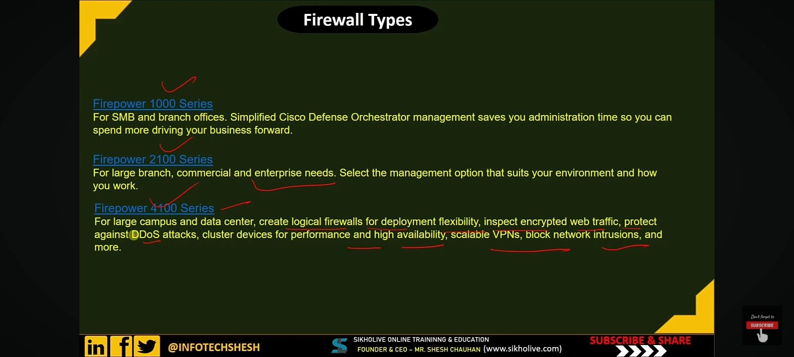
---

## 5️⃣ Cisco Access Point (AP)

### 🔹 Introduction
A **Cisco Access Point** provides wireless connectivity to devices within a network, allowing users to connect through Wi-Fi instead of cables.

### 🔹 Working Principle
Access Points connect to a wired network and transmit wireless signals to nearby devices. They use protocols like 802.11a/b/g/n/ac/ax to manage wireless communication.

### 🔹 Features
- Dual-band (2.4 GHz & 5 GHz) operation  
- MU-MIMO support  
- Centralized management via Cisco DNA Center or Meraki Cloud  
- Enhanced security with WPA3  
- Seamless roaming support  

### 🔹 Benefits
- Wireless mobility  
- Simplified network expansion  
- Secure and scalable wireless access  
- Supports IoT and BYOD environments  

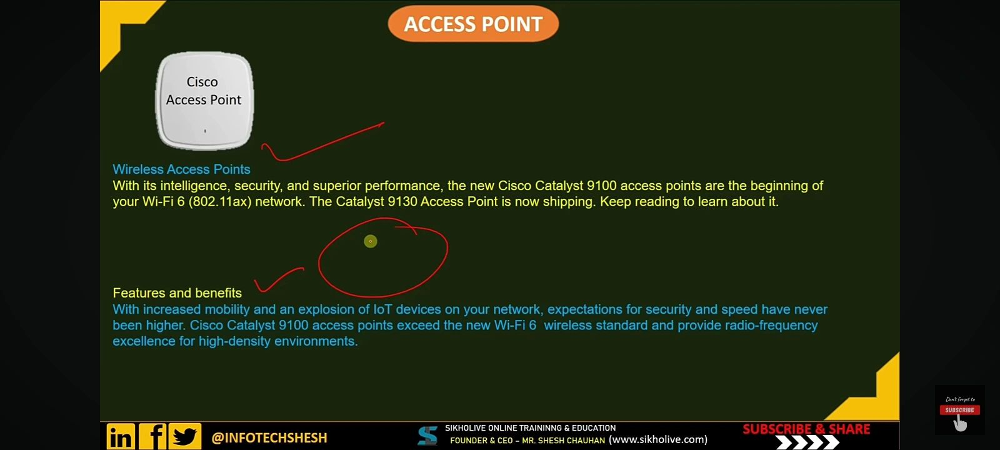
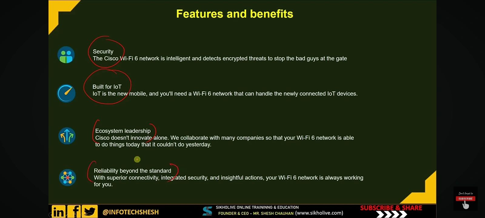
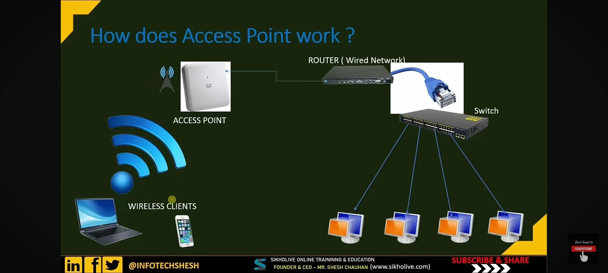

---

## 6️⃣ Cisco DNA (Digital Network Architecture)

### 🔹 Introduction
**Cisco DNA** is an intent-based networking platform that simplifies enterprise network management through automation, analytics, and security.

### 🔹 Features
- **Network Automation:** Automate configurations and policy enforcement.  
- **Analytics & Assurance:** Provides AI-driven insights into network performance.  
- **Security:** Integrated threat detection and policy-based access control.  
- **Cloud Management:** Manage networks from a centralized cloud dashboard.  

### 🔹 Benefits
- Simplified network operations  
- Faster troubleshooting with AI insights  
- Enhanced network visibility  
- Reduced operational costs  
- Scalable for future network demands  

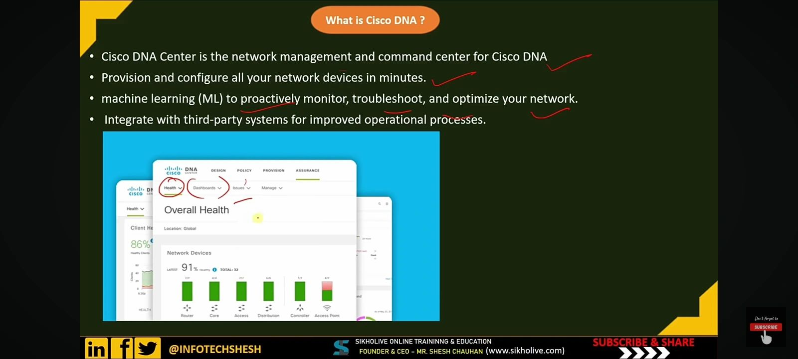
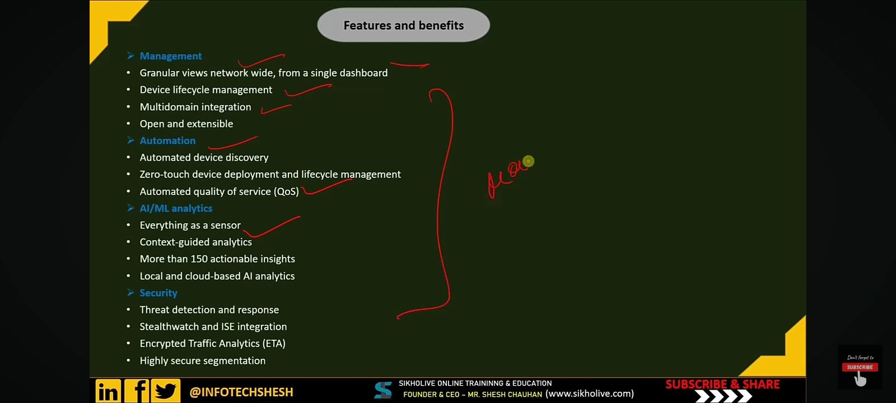

---

## 7️⃣ On-Premises vs Cloud Server

| Feature | On-Premises Server | Cloud Server |
|----------|-------------------|---------------|
| **Deployment** | Installed and maintained locally | Hosted on a cloud provider’s infrastructure |
| **Cost** | High initial investment (hardware, setup) | Pay-as-you-go subscription |
| **Maintenance** | Managed by in-house IT team | Managed by cloud provider |
| **Scalability** | Limited by physical hardware | Easily scalable on demand |
| **Security** | Full control over data security | Relies on provider’s security measures |
| **Accessibility** | Limited to local or VPN access | Accessible from anywhere via the internet |
| **Backup & Recovery** | Manual setup required | Automated and integrated |
| **Examples** | Local data center | AWS, Google Cloud, Microsoft Azure |

### 🔹 Conclusion
- **On-Premises:** Ideal for organizations requiring full control, compliance, and local infrastructure.  
- **Cloud Server:** Best for scalability, remote access, and cost efficiency.

---

## 📘 Summary

Today’s learning covered essential **Cisco networking devices** and concepts:
- Subnetting improves network efficiency and IP management.
- Cisco Routers and Switches form the backbone of communication.
- Firewalls and Access Points ensure secure and flexible connectivity.
- Cisco DNA brings automation and intelligence to network operations.
- Understanding the difference between on-premises and cloud environments helps design better infrastructure solutions.

---

