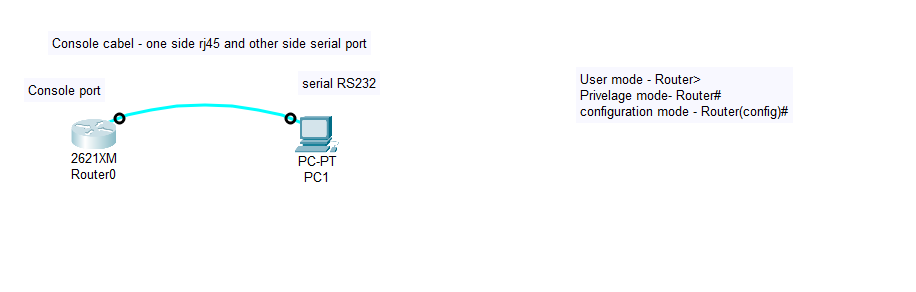

# 🧠 Cisco Router Console Configuration using PC (RS-232 Connection)

## 🧩 Network Setup

**Objective:**  
To configure a Cisco Router using the **console connection** between a **Router** and a **PC (PC1)** in **Cisco Packet Tracer**.

### 🖧 Topology Description:
- **Router Console Port** ↔ **PC1 RS-232 Port**
- **Connection Type:** Console Cable
- **Purpose:** Local router configuration using the **CLI (Command Line Interface)** before enabling remote access.



---

## ⚙️ Accessing the Router via Console

1. Connect the **Console cable**:
   - One end to the **Router’s Console port**
   - Other end to **PC1’s RS-232 port**

2. On **PC1**, open:
Desktop → Terminal → OK

yaml
Copy code

3. You’ll now access the router’s **CLI (Command Line Interface)** directly.

---

## 🧾 Basic Router Configuration Commands

### 🔹 Entering Privileged EXEC Mode
```bash
Router> enable
Moves from User EXEC Mode (Router>) to Privileged EXEC Mode (Router#).
Allows you to use higher-level commands such as show, copy, and configure.

🔹 Entering Global Configuration Mode
bash
Copy code
Router# configure terminal
or

bash
Copy code
Router# conf t
Enters the Global Configuration Mode (Router(config)#).
This mode allows changes to the router’s configuration.

🔹 To View All Available Commands
bash
Copy code
Router(config)# ?
Displays all possible commands available in the current configuration mode.

🔐 Setting and Removing Passwords
🔹 Set Enable Password (for Privileged Mode)
bash
Copy code
Router(config)# enable password 123
Sets a password 123 to protect Privileged EXEC Mode access.
You’ll need to enter this password when using the enable command.

🔹 Remove Enable Password
bash
Copy code
Router(config)# no enable password
Removes the existing enable password.

💬 Setting and Removing Banners
🔹 Set Message of the Day (MOTD) Banner
bash
Copy code
Router(config)# banner motd "Welcome to my Router"
Displays a message whenever someone logs into the router.
Often used for legal warnings or identification messages.

🔹 Remove MOTD Banner
bash
Copy code
Router(config)# no banner motd
Deletes the existing MOTD banner.

🧹 Removing Configuration Commands
bash
Copy code
Router(config)# no [command]
The no keyword removes or disables an existing configuration.

Examples:

bash
Copy code
Router(config)# no enable password
Router(config)# no banner motd
🖋️ Changing Router Hostname
bash
Copy code
Router(config)# hostname R1
Changes the router’s hostname to R1.
The CLI prompt now appears as:

scss
Copy code
R1(config)#
🔍 Viewing Configuration
🔹 Show Running Configuration
bash
Copy code
Router# show running-config
Displays the current active configuration stored in RAM.

🔹 Run Privileged Commands from Configuration Mode
bash
Copy code
Router(config)# do show running-config
Allows execution of Privileged Mode commands without leaving Configuration Mode.

🔒 Encrypting Passwords
bash
Copy code
Router(config)# service password-encryption
Encrypts all plain-text passwords in the router configuration file.
Prevents passwords from being easily read in show running-config.

👤 Securing Console Access
🔹 Steps to Configure Console Password
bash
Copy code
Router(config)# line console 0
Router(config-line)# password 123
Router(config-line)# login
Router(config-line)# exit
🔹 Explanation
line console 0 → Enters console line configuration mode (for physical console access).

password 123 → Sets the password for console login.

login → Enables the console login prompt.

exit → Exits line configuration mode.

💡 Additional Basic Router Commands
Command	Description
Router# show version	Displays hardware and software version information
Router# show interfaces	Shows the status and statistics of all interfaces
Router# show ip interface brief	Provides summarized interface info (IP and status)
Router# show startup-config	Displays the configuration stored in NVRAM
Router# copy running-config startup-config	Saves the current configuration to NVRAM
Router# reload	Reboots the router
Router(config)# interface gigabitEthernet 0/0	Enters interface configuration mode
Router(config-if)# ip address 192.168.1.1 255.255.255.0	Assigns IP to interface
Router(config-if)# no shutdown	Activates (enables) the interface
Router(config)# exit	Exits the current configuration mode

🧠 Summary
In this lab, you learned how to:

✅ Connect a Router and PC using a Console (RS-232) cable
✅ Access User, Privileged, and Configuration modes
✅ Configure and remove passwords and banners
✅ Use the no command to remove settings
✅ Change hostname and encrypt passwords
✅ Secure console access with login authentication
✅ View, save, and manage router configurations