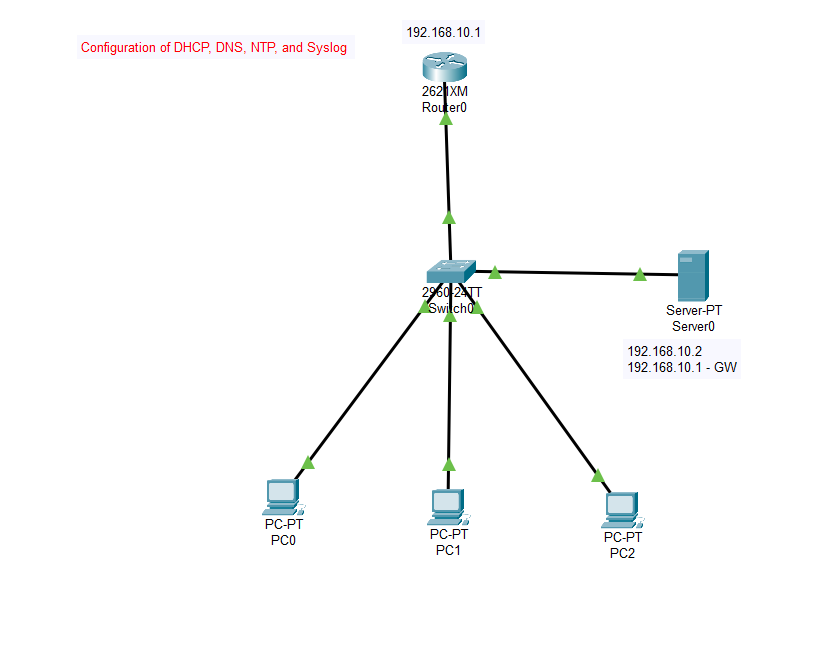

# 🧪 Lab:Configuration DHCP, DNS, NTP, Syslog & TFTP Backup in Packet Tracer

## 🎯 Objective
- Configure DHCP, DNS, NTP, Syslog  
- Backup router config to TFTP  

---
### Topology


## 🖧 Topology Summary
- **Router:** R1 (192.168.10.1)  
- **Server:** Server-PT (192.168.10.2, TFTP 192.168.10.3)  
- **Switch:** S1  
- **PCs:** PC1, PC2, PC3 (DHCP clients)  

---

## ⚡ Step-by-Step Commands

### 1️⃣ Router Basic Config
```bash
R1> enable
R1# configure terminal
R1(config)# hostname R1
R1(config)# interface g0/0
R1(config-if)# ip address 192.168.10.1 255.255.255.0
R1(config-if)# no shutdown
R1(config-if)# exit
R1(config)# end
R1# write memory
R1# show ip interface brief
```
2️⃣ DHCP (Server)
Server → Services → DHCP → ON

Pool: Default GW=192.168.10.1, DNS=192.168.10.2, Start IP=192.168.10.10, Subnet=255.255.255.0, Max Users=50

3️⃣ DNS (Server)
Server → Services → DNS → ON

Record: www.cisco.com → 192.168.10.2

Test: ping www.cisco.com (from PC)

4️⃣ NTP
Server: Services → NTP → ON
Router:

```bash

R1# configure terminal
R1(config)# ntp server 192.168.10.2
R1(config)# service timestamps log datetime msec
R1# show ntp associations
R1# show clock
```
Troubleshoot:
```bash
ping 192.168.10.2
```
Wait 1–2 minutes

Optional: ntp master 1

5️⃣ Syslog
Server: Services → SYSLOG → ON
Router:

```bash

R1# configure terminal
R1(config)# logging 192.168.10.2
R1(config)# logging trap debugging
R1# debug ip icmp
```

6️⃣ TFTP Backup
Server: Services → TFTP → ON
Router Backup:

```bash

R1# copy running-config tftp:
Address or name of remote host []? 192.168.10.3
Destination filename [r1-confg]? (Enter)
```
Restore Config:
```bash
R1# copy tftp: running-config
Address or name of remote host []? 192.168.10.3
Source filename []? R1-confg
Destination filename [running-config]? (Enter)
```
🔍 Verification Commands
```bash
show ip interface brief
ping www.cisco.com
show ntp associations
show ntp status
show logging
```


⚠️ Troubleshooting
DHCP: ensure DHCP ON, correct gateway

DNS: check DNS ON, ping IP resolves

NTP: check ping to server, wait, optional ntp master

Syslog: correct logging IP, service ON

TFTP: ping server, TFTP ON, correct filename