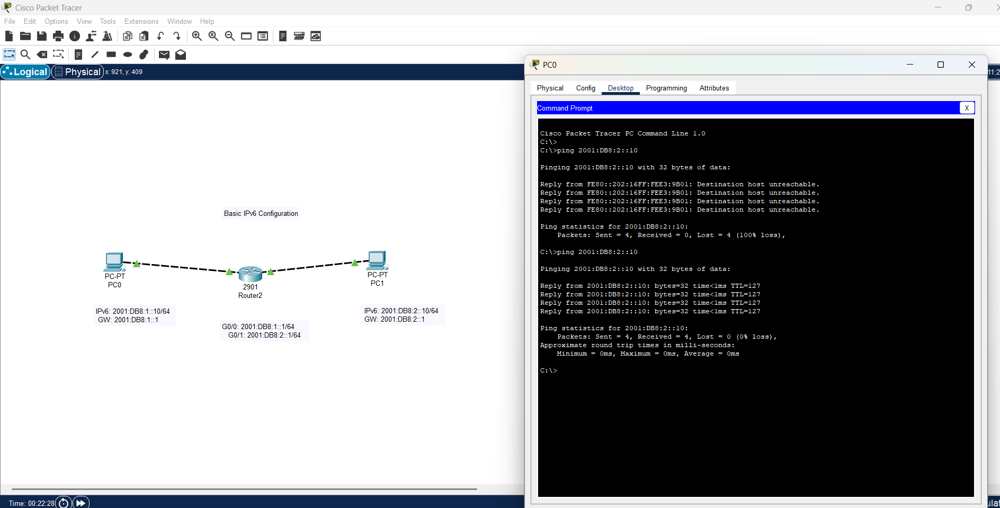

# 🧪 Lab: Configure IPv6 on Routers and PCs

## 🎯 Objective
Configure and verify IPv6 addressing and connectivity between Router interfaces and PCs in Cisco Packet Tracer.

---

## 🖧 Network Topology

---

## ⚙️ Step 1: Enable IPv6 Routing on Router

```bash
R1> enable
R1# configure terminal
R1(config)# ipv6 unicast-routing
``` 

⚙️ Step 2: Assign IPv6 Addresses
```bash
R1(config)# interface gigabitEthernet0/0
R1(config-if)# ipv6 address 2001:DB8:1::1/64
R1(config-if)# no shutdown
R1(config-if)# exit

R1(config)# interface gigabitEthernet0/1
R1(config-if)# ipv6 address 2001:DB8:2::1/64
R1(config-if)# no shutdown
R1(config-if)# exit
```

⚙️ Step 3: Configure IPv6 on PCs
PC1
IPv6 Address: 2001:DB8:1::10

Prefix Length: 64

Default Gateway: 2001:DB8:1::1

PC2
IPv6 Address: 2001:DB8:2::10

Prefix Length: 64

Default Gateway: 2001:DB8:2::1

⚙️ Step 4: Configure Static Route (Optional for Multi-Router Labs)
If you have two routers (R1–R2), configure static routes:

```bash
R1(config)# ipv6 route 2001:DB8:2::/64 2001:DB8:12::2
R2(config)# ipv6 route 2001:DB8:1::/64 2001:DB8:12::1
```
🧩 Verification Commands
```bash

R1# show ipv6 interface brief
R1# show ipv6 route
PC1> ping 2001:DB8:2::10
PC2> ping 2001:DB8:1::10
```

✅ If pings are successful, IPv6 configuration is correct.

🧰 Troubleshooting Tips
Issue	Check
Ping fails	Verify IPv6 address and prefix length
No response	Ensure interfaces are no shutdown
PCs not reachable	Check default gateway
No routing	Enable IPv6 routing (ipv6 unicast-routing)

🧠 Key Concepts
IPv6 uses 128-bit addresses

Link-local addresses (FE80::/10) are automatically generated

Use ipv6 unicast-routing to enable routing between IPv6 networks

Static and dynamic routing protocols (e.g., RIPng, OSPFv3) can be used for IPv6